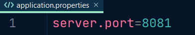

# PRODUCT web api


----
### information

Backend project for product api. trying to simulate api for ecommerce product module which also includes user login
and registration. specific role is also provided like admin or normal user. multiple roles can be added its not limited to 
only admin and user. uses JWT token based authentication. user or admin password are secured with BCRYPT

### Main features used
- spring data jpa (with extra pagination and sorting)
- Hibernate
- Jwt Token based Authentication
- Spring security
- Spring rest
- swagger ui ( limited not configured for complete project)
- lombok project
- MySql database/H2 db


### software requirements
- Intellij idea / Eclipse or any other IDE that supports spring framework (*configure settings for hibernate module in settings if req.)
- MySql Community server (if you don't want to use mysql please change application properties to use H2 Database)
- Postman or any other Api testing software

### Initiated parameters
- ADMIN user 1 details = username : admin_01 , password : admin_01
- ADMIN user 2 details = username : admin_02 , password : admin_02

### running this api project
- clone this project by using (https://github.com/someshsurve/WebProductApi.git) or simply download it.
- create schema in sql with name "code0db"
- with pom.xml included import or build project so that all dependencies will be added
- run WebProject Module
- now let's create user so that we can access api
- before using you can set where you want to local host your api. in applicaion properties you can change

- now access ```localhost:8081/register``` `GET` to create new user
- provide json body ```{
  "userName":"sam",
  "userPassword":"sam01",
  "userFirstName":"somesh",
  "userLastName":"surve"
  }``` and this details
- and post it new user will be created
-  
- now let's login ```localhost:8081/login``` `POST`
- ```{"userName":"sam","userPassword":"sam01"}``` with this json body that uses username and password from user we created.
-  
- it return jwt token copy it login is successful
- now you can use this token to access all api that is available for this user
- ```localhost:8081/product/products``` `GET` please include generated token from login
- 
- 
- that's it you can access all other apis listed below.

### api's to access
- AVAILABLE TO ALL
- ```localhost:8081/register``` `POST`
- ```localhost:8081/post``` `POST`

- FOR USER ROLE AND ADMIN ROLE
- ```localhost:8081/product/products``` `GET`
- ```localhost:8081/product/productWithId/{id}``` `GET`
- ```localhost:8081/product/productWithName/{name}``` `GET`
- ```localhost:8081/product/products/{field}``` `GET`
- ```localhost:8081/product/productsPagination/{offset}/{pageSize}``` `GET`
- ```localhost:8081/product/productsPaginationandsorting/{field}/{offset}/{pageSize}``` `GET`


- FOR ADMIN ROLE ONLY
- ```localhost:8081/product/addProduct``` `POST`
- ```localhost:8081/product/addProducts``` `POST`
- ```localhost:8081/product/update``` `PUT`
- ```localhost:8081/product/delete/{id}``` `DELETE`


